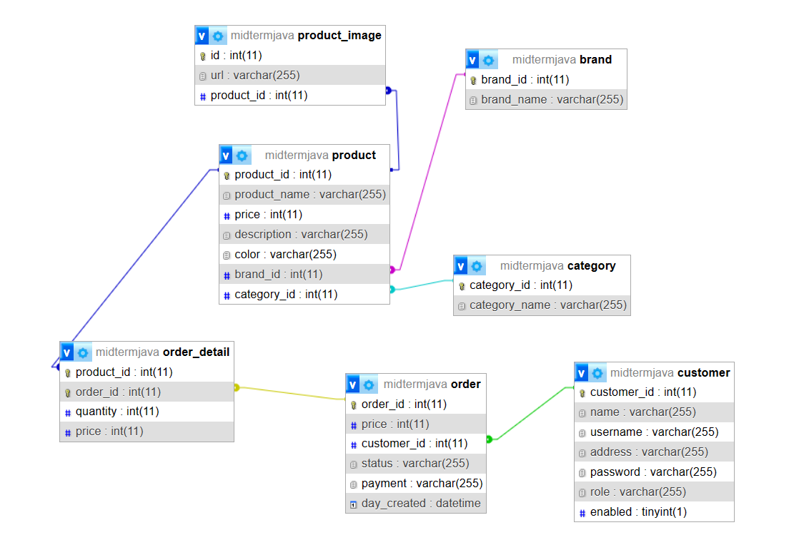
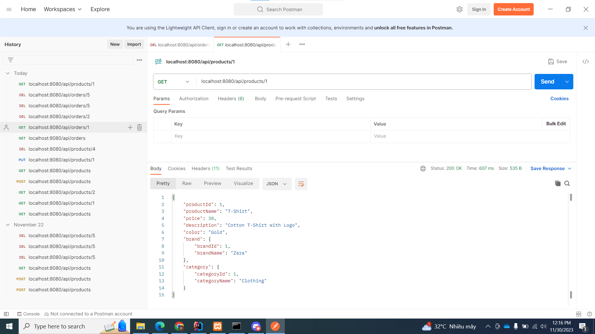
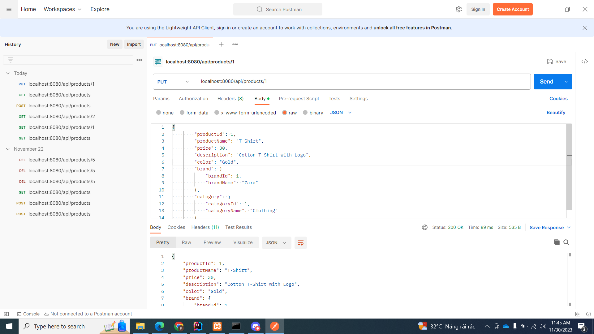
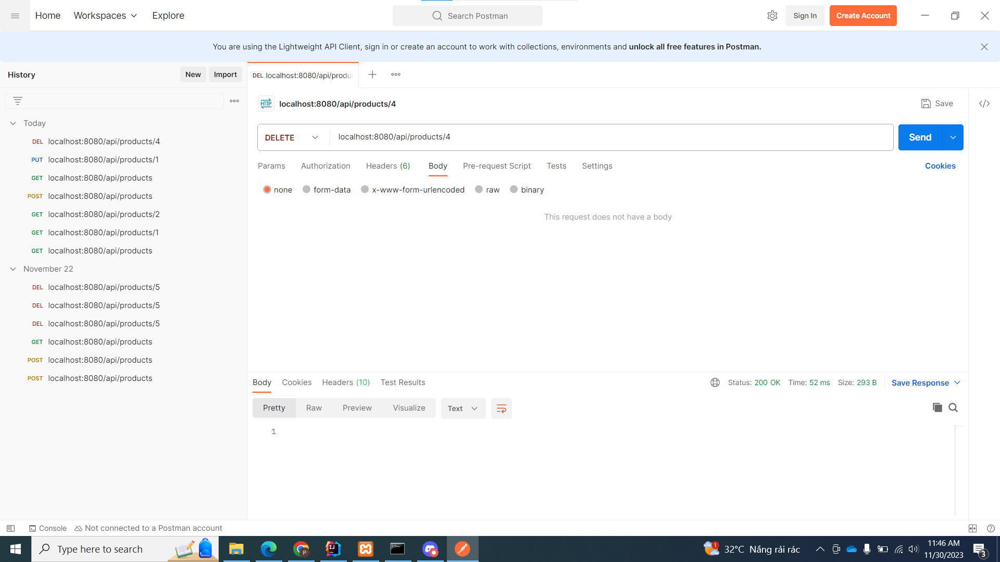
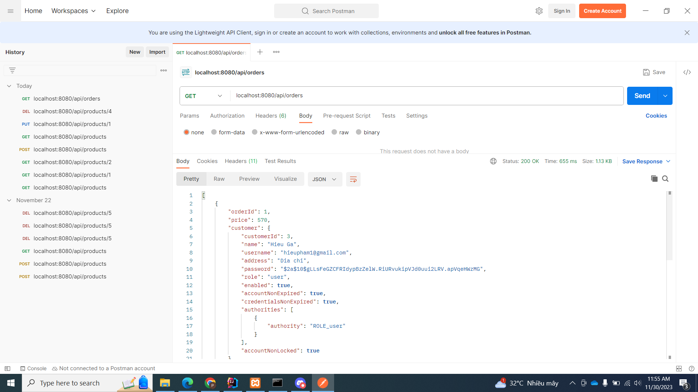
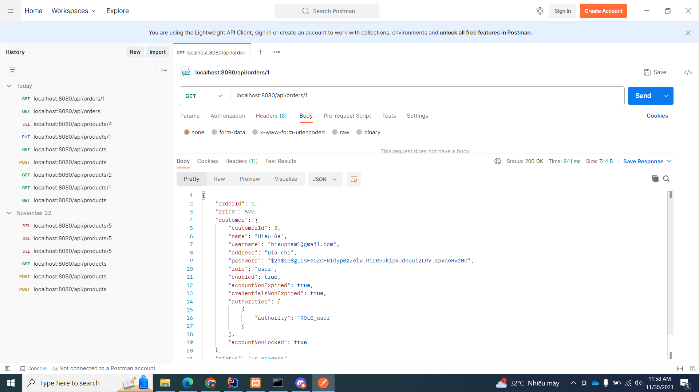

<h3 align="center">Java Midterm Project</h3>
 
<a href="https://github.com/HieuPham-origin/JavaTechnology_N2T02_MIDTERM">Repository of midterm project</a>

  
Table of Contents

    <a href="#about">About the project</a>
 
    <a href="#brief">Brief explanation</a>
 
    <a href="#codestructure">Code structure</a>
 
    <a href="#howtorun">How to run</a>
 
    <a href="#erd_api">ERD Diagram, APIs</a>
 
    <a href="#demo">Video demo</a>

## About The Project

This is a web application that allows users to browse a catalog of products and filter them by category, brand, color, and price range. It was built using Java, Spring Boot, Thymeleaf, and Bootstrap.

## Brief Explanation

In this repo, software development principles, patterns, and practices are being applied, including:

<ol>
    <li>Model-View-Controller (MVC) architecture: The app follows the MVC design pattern, separating the application into three components - Model, View, and Controller. This separation of concerns helps in maintaining the codebase and makes it easier to modify or scale the application in the future.</li>
    <li>Object-Relational Mapping (ORM): The app uses Hibernate, which is an ORM framework, to map Java objects to relational database tables. This abstraction layer helps in dealing with the complexities of object-oriented programming and relational databases.</li>
    <li>Dependency Injection (DI): The app uses Spring Framework's DI functionality to inject dependencies into classes, reducing coupling between components and making the code more modular and maintainable.</li>
</ol>

## Code Structure

The code structure of this repo follows the standard MVC (Model-View-Controller) architecture pattern.

- `com.example.models`: contains entity classes representing model of this application.
- `com.example.repositories`: contains interfaces for interacting with database, extends the JpaRepository.
- `com.example.services`: contains service classes.
- `com.example.config`: contains classes to config Spring Security.
- `com.example.dtos`: contains DTO (Data transfer object) classes.
- `com.example.controllers`: contains classes for handling user requests ,responses and renders views.

## How to run

<ol>
    <li>
        import database.sql into the phpMyAdmin, the database will be created.
    </li>
    <li>Add some sample data by using the sql command in data.sql</li>
    <li>
        Clone the repo with this command in cmd:
         
        git clone https://github.com/HieuPham-origin/JavaTechnology_N2T02_MIDTERM
    </li>
    <li>
        After that, open the repo with IntelliJ IDEA.
    </li>
    <li>Open XAMPP, start APACHE and MySQL Service.</li>
    <li>Run the application in MidtermApplication.java in the project.</li>
</ol>

## ERD Diagram, API/Products, API/Orders

### ERD Diagram

### API/Products

#### GET: localhost:8080/products

#### GET: localhost:8080/products/{id}

#### POST: localhost:8080/products

#### PUT: localhost:8080/products/{id}

#### DELETE: localhost:8080/products/{id}

### API/Orders

#### GET: API/Orders

#### GET: API/Orders/{id}

## Video Demo